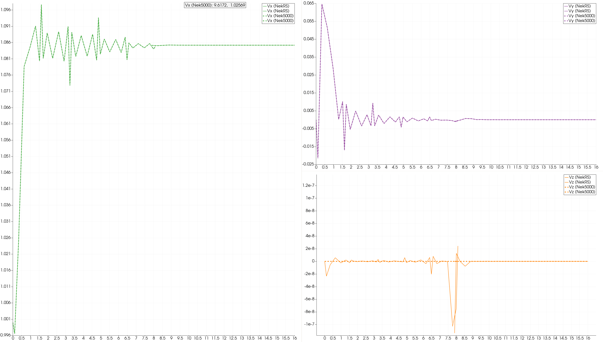

# NekNek examples

Version nekrs v24-pre (repo/next + some fixes)

The base case is a 3D channel flow with 
- Inflow / Outflow in x-direction      
  Here we use constant velocity at inlet, which is not physical with the corner of Wall and it will create oscillation. 
  However, it's still a usual approach to get fully developped flow and the error will fade away downstream.

- Wall / Symmetric in y-direction

- Periodic in z-direction

Since there will be stress formulation (preparing for RANS) and SYM-Outlow corner, the outflow needs `"ON "` BC zeroing out the non-normal velocity.

### Cases

Here we consider only 2 meshes, but there are still several configurations for different coupling.
We will focus on the inlet - outlet one. Basically, each mesh is put in a seperated subfolder with the paths specified in `*.sess` file.
See the `mv_log.sh` script for easy copying the logfiles.

- channelInletOutlet: `channelInletOutlet.sess`
  - inlet/
  - outlet/
  - ref_nek5k/

- ktauChannelInletOutlet
  - inlet/
  - outlet/

- (WIP) channelBottomTop
  - inlet/
  - outlet/
  - ref_nek5k/

- (WIP) channelBottomTopPeriodic
  - inlet/
  - outlet/
  - ref_nek5k/

### Verification

NekRS vs Nek5000

- Inlet Outlet
  

- Bottom Top

### Notes

- flow rate control is not supported
- (nekrs) multi-rate neknek is there but not tested
- Stability for `neknek->nEXT > 1` may require a larger `"ngeom"`, user need to set it in `nrs->userConvergeCheck`
  `nEXT=1` is unconditionally stable (by Ketan)
