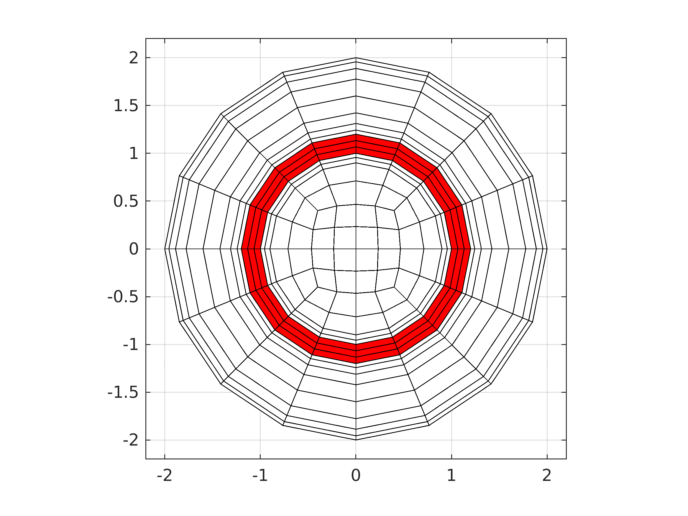
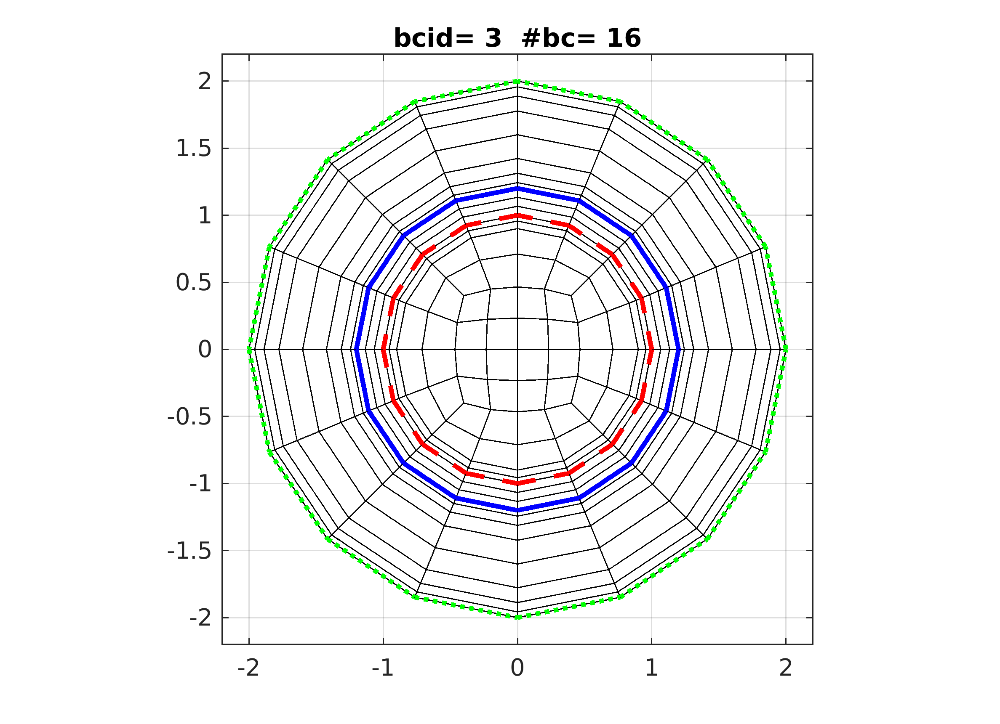
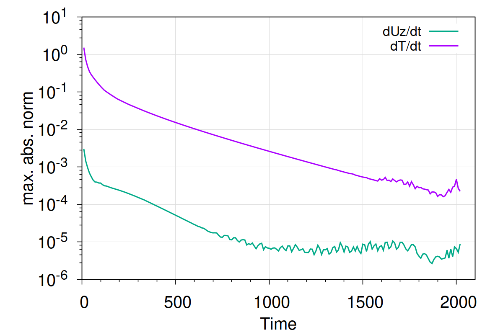
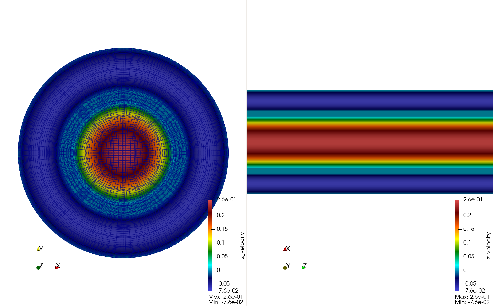
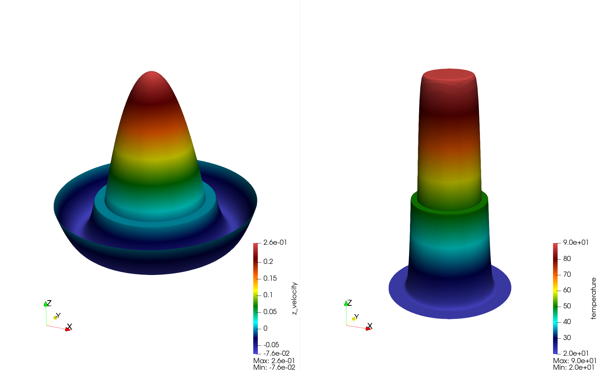
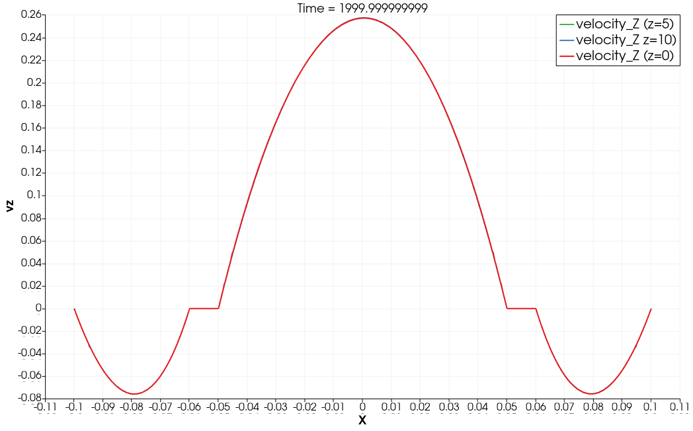
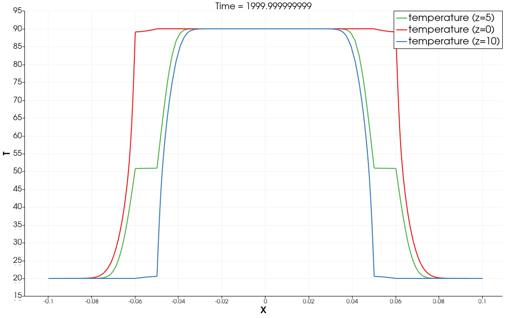

## Double pipes couterflow heat exchanger

Version: NekRS v26

This example features
- Running NekRS case in dimensional units
- Two fluid systems separated by solid domain
- Dual recycling inlet

| Domain | Material | T (inlet) | U (vz, inlet) | hydro diameter | Re_D | Pe_D |
|:---|:---|:---|:---|:---|:---|:---|
| $0 < r < r_1$   | hot water  | $90^\circ C$ |  1.29e-1 [m/s] | $2 r_1$      | 2.3300e+04 | 8.2854e+04 |
| $r_1 < r < r_2$ | copper     |              |                |              |            |            |
| $r_2 < r < r_3$ | cold water | $20^\circ C$ | -5.03e-2 [m/s] | $2(r_3-r_2)$ | 7.2682e+03 | 2.5845e+04 |

```
r1 = 0.05 [m]
r2 = 0.06 [m]
r3 = 0.1  [m]

         rho [kg/m3] mue      rhoCp      con 
water    988.0       5.47e-4  4.12984e6  0.643
copper                        3.44960e6  385
```

## Mesh

The 2D mesh, generated by my [OneCylinder](https://github.com/yslan/OneCylinder) MATLAB script.

```
r1 = 1.0, r2 = 1.2, r3 = 2.0
```

The BCs in the 2D mesh are first assigned as the follows:

| Domain | Fluid BC | Heat BC |
|:---:|:---:|:---:|
|  |  |  |

```
fluid
   red dashed line:  W
   blue solid line:  W01
   green solid line:  W02
heat
   red dashed line:  t
```

Note: the 2D mesh is plotted with linear edge. In nek, it's recovered to cylinder curves. See below.

The 3D mesh is extruded in z to have `z in [0,10]` with `nelz=10`, and the BCs in zmin and zmax are all assigned to `O  `.
In `usrdat2`, we use `zmid=5.0` and `rmid=1.1` (can be obtained by any interior point in solid) to assign the BCs.

## Early Results

- Steady state check  
  At time = 2000, both velocity and temperature settle to (near) steady state.  
  

- vz slices at z=5 (left) and at y=0 (right)    
  

- vz (left) and T (right) wrap in z direction at z=5.   
  

- vz at several x lines (z=0, 5, 10)      
  

- T at several x lines (z=0, 5, 10)    
  

- T outlet
  T outlet is the surface integral average of the temperature at outlet.

  $$T_{bar} = \int_A T dA / \left(\int_A dA\right) = \int_A T dA / A$$
  $$T_{bulk} = \int_A uT dA / \left(\int_A u dA\right) = \int_A uT dA / (A * U)$$


  T_bulk

  ```
  T_bulk  inlet       outlet
  hot     90          87.1376458
  cold    20          22.8850030

  T_bar
  hot     90          79.1581461
  cold    20          25.4244381
  ```

## Validation

We deploy recycled inlet to maintain prescribed mean flow, turbulent outlet for stability (if backflow presents), and walls for the rest.
For the temperature BCs, only inlet temperature is set and the rest are all insulated wall.

Table from ChatGPT (using 1D estimation)

```
m_dot   U1        U2        Re1      Re2      Pe1      Pe2      T_final         Th,out   Tc,out
kg/s    m/s       m/s
----------------------------------------------------------------------------------------------------
0.233   3.00e-2   1.17e-2   5.42e3   1.70e3   1.93e4   6.04e3   23.8 min        77.42    32.58
1       1.29e-1   5.03e-2   2.33e4   7.28e3   8.28e4   2.59e4   9.95 min        75.84    34.16
10      1.29e0    5.03e-1   2.33e5   7.28e4   8.28e5   2.59e5   3.48 min        80.95    29.05
100     1.29e1    5.03e0    2.33e6   7.28e5   8.28e6   2.59e6   1.48 min        86.72    23.28
1000    1.29e2    5.03e1    2.33e7   7.28e6   8.28e7   2.59e7   49.5 s          88.87    21.13
3000    3.87e2    1.51e2    6.99e7   2.18e7   2.49e8   7.77e7   32.0 s          89.30    20.70
8000    1.03e3    4.03e2    1.86e8   5.83e7   6.63e8   2.07e8   23.3 s          89.57    20.43
```


TODO
- fix parameters, nondimensionalize
- add nusselt number
- planar avg
- recycling temperature to achieve target Tbulk at inlets
