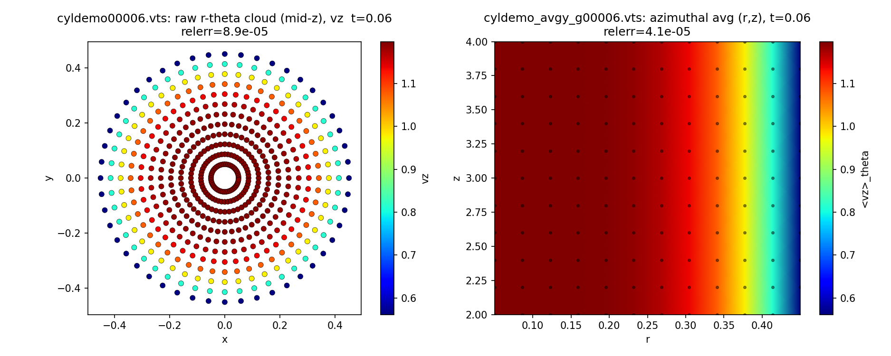

# fieldExtract — NekRS box data sampler

Header-only NekRS v26 utility. It interpolates solution fields onto a uniform
**1D / 2D / 3D** grid of points (via `pointInterpolation_t` / findpts) and writes the
sampled grid to disk. Two IO backends, selected per call by a trailing `format`
argument: **`"vts"`** (default) writes one VTK `.vts` StructuredGrid per call via
MPI-IO; **`"adios"`** writes one ADIOS2 `.bp` per stem (steps appended) carrying a VTK
UnstructuredGrid schema so ParaView opens it directly (requires NekRS built with ADIOS).
Box-mode samplers can also dump **line / planar / box averages** (`doAvg`). Points are
distributed evenly across MPI ranks; the output is read back and validated in Python.

---

## Files

| File | Purpose |
|------|---------|
| `fieldExtract.hpp` | The sampler (header-only; copy into a NekRS case). |
| `turbPipe_t1.udf` | **Clean minimal example** — a single box sampler. Start here. |
| `turbPipe.udf` | **All-modes test driver** — samplers box 1d/2d/3d, cylinder, GLL box; box3d also in ADIOS. |
| `turbPipe_cyl.udf` | **Cylinder demo** — full-circle r-θ-z grid + azimuthal average via `setQuadrature` (Plan G). Run as its own case `turbPipe_cyl`. |
| `udf.cmake` | Case-local CMake hook that links ADIOS2 into `libudf` (needed for the `"adios"` backend). |
| `turbPipe.{par,re2,usr}` | Rest of the runnable NekRS case (`turbPipe_cyl.{par,usr}` + a `.re2` symlink run the cylinder demo). |
| `fe_read.py` | Shared Python loader + analytic validators (`load`, `load_bp`, `check`, `ref_vz`, `ref_T`, `trap_avg`, `check_avg`, `azimuthal_avg`). |
| `test_<cfg>.py` | Per-config validators: `test_box1d/box2d/box3d/cyl/box3dgll.py`. |
| `test_avg.py` | Validates the `doAvg` outputs against numpy weighted averages of the source boxes. |
| `test_cyl_avg.py` | Validates the cylinder azimuthal average (exact θ-mean contract + analytic `<vz>_θ=vz`, `<temp>_θ=0`). |
| `test_bp.py` | Validates the ADIOS `.bp` outputs: analytic check, avg families, and a cross-format A/B (`.bp` vs `.vts`) to float32. |
| `test_gll_quadrature.py` | Pure-python GLL quadrature tests (zwgll sanity, GLL vs trapezoid accuracy); runs without NekRS. |
| `test_gll_viz.py` | Pcolor + mesh of the `box3d_gll_avgy_g*` x-z GLL plane — the grid clustering is visible by eye (`test_gll_viz.png`). |
| `test_bp_viz.py` | Side-by-side mid-y x-z slice of `box3d.bp` vs the paired `.vts` (`test_bp_viz.png`). |
| `test_cyl_viz.py` | Raw r-θ point cloud + azimuthally-averaged (r,z) profile of the cylinder demo (`test_cyl_viz.png`). |
| `test_viz.py` | Visualize the samplers in one figure. |
| `test.py` | Original single-`.vts` reader / plotting example. |

> Note: the clean example is on disk as **`turbPipe_t1.udf`** (you referred to it as
> `v1`). NekRS runs `<case>.udf`, i.e. `turbPipe.udf` — swap in `turbPipe_t1.udf` if you
> want the minimal version.

---

## Usage

1. Copy `fieldExtract.hpp` next to your case and `#include` it in the `.udf`.
2. Construct one sampler per region in `UDF_Setup`.
3. Call `process(time, tstep)` on your chosen cadence in `UDF_ExecuteStep`.
   Add a trailing `"adios"` to write ADIOS `.bp` instead of `.vts` (see below).
4. **Release each global sampler on the last step** so the findpts MPI communicator (and
   any open ADIOS engine) is freed *before* `MPI_Finalize` (otherwise MPICH warns about
   freeing a comm after finalize):

```cpp
if (nrs->lastStep) sampler.reset();
```

### Constructors

```cpp
// Box mode — grid spanning the diagonal x0 -> x1 (uniform points by default)
fieldExtract(mesh, boxDims, fldList, fname, x0, x1);
fieldExtract(mesh, boxDims, fldList, fname, x0, x1, {"gll"});            // GLL on all axes
fieldExtract(mesh, boxDims, fldList, fname, x0, x1, {"gll", "gll", "uniform"}); // per axis

// Points mode — user-supplied Cartesian coordinates (one std::vector per axis)
fieldExtract(mesh, boxDims, fldList, fname, XYZ);
```

- `boxDims` — point counts `{nx, ny, nz}`, endpoints included. Size 1/2/3 gives a
  line/plane/box; the shape is recorded in the `.vts` (no filename tag).
- `pointDist` (box mode, optional) — per-axis point distribution, `"uniform"`
  (default) or `"gll"` (Gauss-Lobatto-Legendre, endpoints included, clustered toward
  the interval ends). One entry applies to all axes; otherwise the size must match
  `boxDims`. Singleton axes are trivially uniform. Nodes come from NekRS `JacobiGLL`
  on the reference domain [-1,1], mapped by `x = x0 + (z+1)/2 (x1-x0)`; the matching
  quadrature weights are recorded so `doAvg` integrates with the right rule.
- `fldList` — `std::vector<fieldExtract::field>`, where
  `field = std::tuple<std::string, std::vector<deviceMemory<dfloat>>>` (name + one device
  array per component; e.g. a scalar has one, a vector has three).
- `fname` — output prefix. Files are `<fname>[_gll]NNNNN.vts`, where `_gll` is appended
  automatically when any axis uses GLL and `NNNNN` is the 1-based dump counter.
- Grid points use lexicographic `(nz, ny, nx)` ordering.

Points mode requires each rank to pass exactly its local share of the points. Use the
static helper to compute that share:

```cpp
static void fieldExtract::pointDistribution(dlong numPoints, dlong &numLocal, dlong &offset);
```

### User-supplied quadrature (`setQuadrature`, points mode)

`doAvg` also works on a **points-mode tensor grid** if you tell it the per-axis
coordinates and quadrature weights:

```cpp
// each coord[a]/weight[a] has length boxDims[a]; weights normalized (sum=1) per axis.
sampler->setQuadrature(coord, weight);   // call after construction, before doAvg
```

The explicit points passed to the points-mode ctor must be the tensor product
`coord[0] × coord[1] × coord[2]` in lexicographic `(nz,ny,nx)` order (your
responsibility — not verified). Weights are whatever rule fits each axis: e.g. a
**periodic azimuth** `θ ∈ [0,2π)` uses `dθ = 2π/nt` (endpoint excluded) and **uniform
weight `1/nt`** — *not* the trapezoid rule (which assumes an inclusive grid and would
mis-weight the wrap-around point). See `turbPipe_cyl.udf` for a full cylinder example:
it builds an `r-θ-z` grid, calls `setQuadrature`, then `doAvg("y")` (axis 1 = θ) to
produce an azimuthally-averaged `(r,z)` profile (emitted as a plane at `y=0`, `x=radius`)
and `doAvg("y","gather-scatter")` to broadcast the average back onto the cloud (rings).
Validate with `python test_cyl_avg.py`; visualize with `python test_cyl_viz.py`:



Left: the raw `r-θ` point cloud at mid-z (axisymmetric `vz` peaks on the axis). Right:
the through-plugin azimuthal average as an `(r,z)` profile. The `relerr` in each title is
against the analytic reference (`<vz>_θ = vz(r)`).

### Averaging (`doAvg`)

Average the current fields over any subset of axes whose dim > 1 and dump one `.vts`
(box mode, or points mode after `setQuadrature`):

```cpp
sampler->doAvg(time, tstep, avgDir);                   // mode defaults to "gather"
sampler->doAvg(time, tstep, avgDir, "gather-scatter");
```

- `avgDir` — non-repeating subset of `xyz` (order-insensitive, case-insensitive):
  `"x"`, `"y"`, `"z"`, `"xy"`, `"yz"`, `"xz"`, `"xyz"`. Averaging a singleton axis
  (`n == 1`) is an error, as is calling `doAvg` on a points-mode sampler.
- `mode`:
  - `"gather"` (default) — collapse the averaged axes; the output grid keeps only the
    surviving dims (collapsed coordinates sit at the box midpoint).
  - `"gather-scatter"` — broadcast the average back onto the **original** box dims
    (same grid shape as `process()` output; handy for diffing against the
    instantaneous field).
- Output: `<fname>[_gll]_avg<dir>_<g|gs>NNNNN.vts` (`g`=gather, `gs`=gather-scatter),
  `NNNNN` a per-(dir, mode) counter. E.g. a 3D box `"xy"` gather average yields
  `<fname>_avgxy_g*.vts` (a z-profile).

It is an **integral average over the sampling grid** using the quadrature rule that
matches each axis's point distribution — trapezoid (endpoints half weight, normalized
by `(n-1)`) on uniform axes, GLL quadrature weights on GLL axes — not a mass-matrix
average over the SEM mesh. Internally each call re-interpolates, pre-reduces local
points into per-cell partial sums, and combines them across ranks with a custom
integer-id gslib/oogs gather-scatter (ids = reduced-cell index, the same pattern as
NekRS `planarAvg`); the handle is built once per direction, cached, and freed in the
destructor.

### IO backend (`format`: `"vts"` | `"adios"`)

Both `process` and `doAvg` take a trailing `format` argument (default `"vts"`):

```cpp
sampler->process(time, tstep);                                  // -> <fname>...NNNNN.vts
sampler->process(time, tstep, "adios");                         // -> <fname>....bp
sampler->doAvg(time, tstep, "xy", "gather", "adios");           // -> <fname>_avgxy_g.bp
```

- `"vts"` — one VTK StructuredGrid file per call, one file per step (`...NNNNN.vts`).
- `"adios"` — one ADIOS2 `.bp` per stem, **steps appended into the same file** (no
  `NNNNN`), written as a VTK **UnstructuredGrid** (`.vtu`) so ParaView opens the `.bp`
  directly. The box lattice becomes hex/quad/line cells (`vertices` + `connectivity` +
  `types`); fields are ADIOS local arrays; the `.vts` FieldData tags (`boxDims`,
  `pointDist`, `numPoints`, `x0`, `x1`) become ADIOS attributes, `time`/`CYCLE`
  per-step variables, and a `vtk.xml` schema attribute drives ParaView.
- **Requires** NekRS built with ADIOS (`NEKRS_ENABLE_ADIOS`) **and** a case-local
  `udf.cmake` that links ADIOS2 into `libudf` and defines `NEKRS_ENABLE_ADIOS` for the
  udf compile (the udf is dlopened, so it does not inherit the define from `nekrs-lib`).
  A copy is provided in this folder — keep it next to your `.udf`. Requesting `"adios"`
  without the define aborts with a clear message; an invalid `format` also aborts.
- Multi-rank note: `.vtu` uses one local block per rank with local connectivity, so a
  hex cell straddling the lexicographic rank boundary is not drawn (a thin seam between
  slabs); **all point/field data is still written**. On a single rank the whole box is
  emitted. Inspect with `bpls <fname>.bp -lav`.

### Minimal example (`turbPipe_t1.udf`)

```cpp
#include "fieldExtract.hpp"
std::unique_ptr<fieldExtract> sampler;

void UDF_Setup()
{
  auto mesh = nrs->meshT;
  std::vector<int> boxDims = {11, 1, 201}; // npts in X, Y, Z

  std::vector<fieldExtract::field> fldList;
  deviceMemory<dfloat> o_w(nrs->fluid->o_U.slice(2 * nrs->fieldOffset, nrs->fieldOffset));
  deviceMemory<dfloat> o_T(nrs->scalar->o_solution("temperature"));
  fldList.push_back({"vz", std::vector{o_w}});
  fldList.push_back({"temp", std::vector{o_T}});

  std::array<dfloat, 3> x0 = {0.0, 0.0, 2.0};
  std::array<dfloat, 3> x1 = {1.0, 0.0, 5.5};
  sampler = std::make_unique<fieldExtract>(mesh, boxDims, fldList, "ttt", x0, x1);
}

void UDF_ExecuteStep(double time, int tstep)
{
  if (tstep % 2 == 0) sampler->process(time, tstep);
  if (nrs->lastStep) sampler.reset();
}
```

### All-modes test driver (`turbPipe.udf`)

Five samplers sharing one `fldList`, each reset on `nrs->lastStep`. The `cyl` sampler
builds a cylindrical `r-θ-z` grid and feeds it through **points mode** using
`pointDistribution` + the same `(nz, nθ, nr)` ordering.

| sampler   | mode   | boxDims     | geometry                                   | output          |
|-----------|--------|-------------|--------------------------------------------|-----------------|
| box1d     | box    | `{1,1,41}`  | line along z (x=0.1, y=0)                   | `box1d*.vts`     |
| box2d     | box    | `{11,1,41}` | XZ plane (y=0)                             | `box2d*.vts`     |
| box3d     | box    | `{11,7,21}` | full box                                   | `box3d*.vts`     |
| cyl       | points | `{6,9,11}`  | r∈[0.05,0.45], θ∈[0,π/2], z∈[2,4]          | `cyl*.vts`       |
| box3d+gll | box    | `{11,7,21}` | box3d extents, **GLL points** (`{"gll"}`)  | `box3d_gll*.vts` |

All regions stay inside the pipe (R=0.5) and within z∈[2,4] so every point is found.

`box3d` is additionally emitted through the **ADIOS backend** (`format="adios"`) on the
same cadence — `box3d.bp`, `box3d_avgxy_g.bp`, `box3d_avgz_gs.bp`, `box3d_avgxyz_g.bp` —
so the two backends can be compared A/B (see `test_bp.py`).

It also exercises `doAvg` on the same cadence, covering both modes and 1/2/3-axis
averages:

| call | mode | output |
|------|------|--------|
| `feBox3d->doAvg(time, tstep, "xy")` | gather | `box3d_avgxy_g*.vts` (z-profile) |
| `feBox3d->doAvg(time, tstep, "z", "gather-scatter")` | gather-scatter | `box3d_avgz_gs*.vts` |
| `feBox3d->doAvg(time, tstep, "xyz")` | gather | `box3d_avgxyz_g*.vts` |
| `feBox3dGll->doAvg(time, tstep, "xy")` | gather (GLL weights) | `box3d_gll_avgxy_g*.vts` |
| `feBox3dGll->doAvg(time, tstep, "z", "gather-scatter")` | gather-scatter (GLL weights) | `box3d_gll_avgz_gs*.vts` |
| `feBox3dGll->doAvg(time, tstep, "y")` | gather (GLL weights) | `box3d_gll_avgy_g*.vts` (x-z GLL plane) |

---

## Python readers

The reference fields (from `turbPipe.udf::test_sol`) are:

```
vz   = 6/5 (1 - (r/R)^6) cos(t)        (r = sqrt(x^2+y^2), R = 0.5)
temp = sin(pi x) cos(2.7 pi z + 0.2)
```

Validate one config (picks the latest matching `.vts`, or pass a filename):

```bash
python test_box3d.py            # prints relerr(vz), relerr(temp) and PASS/FAIL
python test_cyl.py cyl00003.vts
```

Each `test_<cfg>.py` calls `fe_read.check(...)`, which loads the file, compares `vz`/`temp`
to the analytic references (masking r > R), and exits non-zero on failure (`tol = 1e-2`).

Validate the averages:

```bash
python test_avg.py
```

For each avg family it pairs the latest `_avg` file with the same-step source box file
and runs two checks per field: an **exact** check against the numpy weighted average
of the source data (`fe_read.check_avg`, `tol = 1e-5` — same grid, same weights
[trapezoid or GLL per the source's `pointDist`], so only float32 storage separates
them) and an **analytic** cross-check against the weighted average of the reference
fields (`tol = 1e-2`). Errors are normalized by the max of the *unaveraged* field,
since some averages vanish by symmetry (e.g. the x-average of `temp ~ sin(pi x)`).

ADIOS `.bp` tests (need the `adios2` python bindings; `load()` dispatches on the `.bp`
extension and reads the latest step via `adios2.FileReader` into the same dict shape as
the `.vts` loader, so all validators work unchanged):

```bash
python test_bp.py              # analytic check + avg families + A/B (.bp vs .vts, float32)
python test_bp_viz.py [field]  # writes test_bp_viz.png (mid-y slice: .bp vs paired .vts)
```

`test_bp.py`'s A/B assertion is the key one: the `.bp` and same-step `.vts` fields (and
coordinates) come from the same interpolation, so they must match to float32 — confirming
the two backends are numerically identical, not just individually plausible.

GLL-specific tests:

```bash
python test_gll_quadrature.py  # pure python, no NekRS run needed
python test_box3dgll.py        # GLL node positions + field values of box3d_gll*.vts
python test_gll_viz.py [field] # writes test_gll_viz.png (pcolor + mesh of the y-avg GLL plane)
```

`test_gll_quadrature.py` validates the ported `zwgll` against closed-form values and
compares GLL quadrature with the trapezoid rule on the analytic fields: both agree
within discretization error, GLL error ≤ trapezoid error, and GLL is exact (~1e-16)
for the polynomial `vz`.

### Visualize the samplers

```bash
python test_viz.py            # field defaults to "vz"
python test_viz.py temp
```

`test_viz.py` loads the latest `.vts` for each config and picks a view by effective
dimensionality — **1D → line, 2D → colormap, 3D → scatter** — titling each panel with its
`relerr`. It is headless-safe (falls back to the `Agg` backend and always writes
`test_viz_<field>.png`).

**`vz`** — `test_viz_vz.png`:


**`temp`** — `test_viz_temp.png`:


---

## The `.vts` layout

`test.py` / `fe_read.py` depend on this structure staying in sync with `fieldExtract.hpp`:

- **FieldData**: `boxDims` (Int32×3), `pointDist` (Int32×3; per-axis code, 0 uniform /
  1 GLL — absent in pre-Plan-D files, readers default to uniform), `x0`/`x1`
  (Float64×3), `numPoints` (Int64), `TimeValue` (Float32), `CYCLE` (Int32).
- **Points**: `Position` (Float32×3), lexicographic `(nz, ny, nx)`.
- **PointData**: one Float32 array per field (`NumberOfComponents` = field dim).

`doAvg` files use the same layout; `boxDims` describes the **output** grid (averaged
axes collapse to 1 in gather mode, stay at full size in gather-scatter mode), while
`x0`/`x1` keep the original box corners.

---

## Runtime output

Each sampler prints one line at setup (rank 0), e.g.

```
fieldExtract(box3d): nPoints=1617  local(min/max/avg)=200/203/202.1
fieldExtract(box3d_gll): nPoints=1617  local(min/max/avg)=200/203/202.1
```

and one line the first time `doAvg` runs on it (`dir`, `mode`, reduced point count).
Wall time is reported through the NekRS timer under `fieldExtract::` — `setup`,
`interpolate`, `avg`, `io` — so it shows up in the standard end-of-run timing summary.

---

## Conventions / constraints

- NekRS v26 API; MPI + OCCA. Header-only: all out-of-class definitions are `inline`;
  `#endif` stays at end of file.
- `field` components are `deviceMemory<dfloat>` (constructs from an `occa::memory`; its
  ctor throws if the source dtype is not `dfloat`).
- A global `unique_ptr<fieldExtract>` **must** be released before `MPI_Finalize`
  (`if (nrs->lastStep) sampler.reset();`).

## Roadmap

- Cylinder / Gauss–Radau point layouts as first-class modes (currently done in the `.udf`).
- Derived fields (e.g. `dT/dz`) in `fldList`.
- Redistribution of explicit `XYZ` that don't match `boxDims` per rank.
- In-memory `data()` accessor; eventual `.hpp` / `.cpp` split.

## Development history

The sampler was built in seven reviewed steps; each has a design note in `plans/` and a
running record (decisions, results, bugs) in `LOGBOOK_*.md`:

| Step | Topic | Plan | Logbook |
|------|-------|------|---------|
| A | Cleanup: split constructors, header-only/ODR fixes, leak fix | `plans/A.md` | `LOGBOOK_A.md` |
| B | Test coverage: box 1d/2d/3d, cylinder + per-config readers | `plans/B.md` | `LOGBOOK_B.md` |
| C | `doAvg` averaging via custom integer-id oogs gather-scatter | `plans/C.md` | `LOGBOOK_C.md` |
| D | Per-axis GLL point distribution + matching quadrature weights | `plans/D.md` | `LOGBOOK_D.md` |
| E | Cleanup: retire geometry tags, prints, timers, `_gll` marker | `plans/E.md` | `LOGBOOK_E.md` |
| F | ADIOS2 `.bp` backend (per-call `format="adios"`, VTK `.vtu` schema) | `plans/F.md` | `LOGBOOK_F.md` |
| G | Cylinder demo + azimuthal averaging via user-supplied quadrature (`setQuadrature`) | `plans/G.md` | `LOGBOOK_G.md` |

`CLAUDE.md` holds the working constraints and a condensed status; `progress071626.md`
is a point-in-time meeting snapshot (predates Step E). Two NekRS-internals gotchas worth
knowing are documented in `LOGBOOK_C.md`: the `ogsSetup` 256-entry local-row limit
(worked around with per-cell pre-reduction) and the `oogs::destroy` `new[]`/`free()`
mismatch (destructor frees with `ogsFree` + `delete[]`). Step F adds two more, in
`LOGBOOK_F.md`: the udf `.so` is dlopened so it does not inherit `NEKRS_ENABLE_ADIOS`
or the adios link from `nekrs-lib` (the case-local `udf.cmake` supplies both), and the
`adios2` 2.10 python `read_attribute` mis-reads array attributes (parse the metadata
`Value` string instead).
