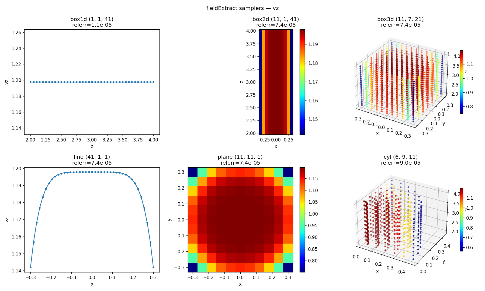
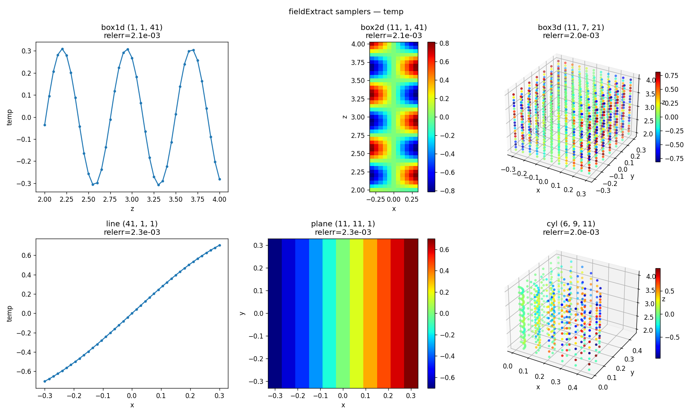

# fieldExtract — NekRS box data sampler

Header-only NekRS v26 utility. It interpolates solution fields onto a uniform
**1D / 2D / 3D** grid of points (via `pointInterpolation_t` / findpts) and writes one VTK
`.vts` StructuredGrid file per call through MPI-IO. Box-mode samplers can also dump
**line / planar / box averages** (`doAvg`). Points are distributed evenly across
MPI ranks; the `.vts` files are read back and validated in Python.

---

## Files

| File | Purpose |
|------|---------|
| `fieldExtract.hpp` | The sampler (header-only; copy into a NekRS case). |
| `turbPipe_t1.udf` | **Clean minimal example** — a single box sampler. Start here. |
| `turbPipe.udf` | **All-modes test driver** — six samplers (box 1d/2d/3d, line, plane, cylinder). |
| `turbPipe.{par,re2,usr}` | Rest of the runnable NekRS case. |
| `fe_read.py` | Shared Python loader + analytic validators (`load`, `check`, `ref_vz`, `ref_T`, `trap_avg`, `check_avg`). |
| `test_<cfg>.py` | Per-config validators: `test_box1d/box2d/box3d/line/plane/cyl/box3dgll.py`. |
| `test_avg.py` | Validates the `doAvg` outputs against numpy weighted averages of the source boxes. |
| `test_gll_quadrature.py` | Pure-python GLL quadrature tests (zwgll sanity, GLL vs trapezoid accuracy); runs without NekRS. |
| `test_gll_viz.py` | Pcolor + mesh of the `box3dgll_avgyPlane*` x-z GLL plane — the grid clustering is visible by eye (`test_gll_viz.png`). |
| `test_viz.py` | Visualize all six samplers in one figure. |
| `test.py` | Original single-`.vts` reader / plotting example. |

> Note: the clean example is on disk as **`turbPipe_t1.udf`** (you referred to it as
> `v1`). NekRS runs `<case>.udf`, i.e. `turbPipe.udf` — swap in `turbPipe_t1.udf` if you
> want the minimal version.

---

## Usage

1. Copy `fieldExtract.hpp` next to your case and `#include` it in the `.udf`.
2. Construct one sampler per region in `UDF_Setup`.
3. Call `process(time, tstep)` on your chosen cadence in `UDF_ExecuteStep`.
4. **Release each global sampler on the last step** so the findpts MPI communicator is
   freed *before* `MPI_Finalize` (otherwise MPICH warns about freeing a comm after
   finalize):

```cpp
if (nrs->lastStep) sampler.reset();
```

### Constructors

```cpp
// Box mode — grid spanning the diagonal x0 -> x1 (uniform points by default)
fieldExtract(mesh, boxDims, fldList, fname, x0, x1);
fieldExtract(mesh, boxDims, fldList, fname, x0, x1, {"gll"});            // GLL on all axes
fieldExtract(mesh, boxDims, fldList, fname, x0, x1, {"gll", "gll", "uniform"}); // per axis

// Points mode — user-supplied Cartesian coordinates (one std::vector per axis)
fieldExtract(mesh, boxDims, fldList, fname, XYZ);
```

- `boxDims` — point counts `{nx, ny, nz}`, endpoints included. Its **size** picks the
  output kind: `1 -> Line`, `2 -> Plane`, `3 -> Box`.
- `pointDist` (box mode, optional) — per-axis point distribution, `"uniform"`
  (default) or `"gll"` (Gauss-Lobatto-Legendre, endpoints included, clustered toward
  the interval ends). One entry applies to all axes; otherwise the size must match
  `boxDims`. Singleton axes are trivially uniform. Nodes come from NekRS `JacobiGLL`
  on the reference domain [-1,1], mapped by `x = x0 + (z+1)/2 (x1-x0)`; the matching
  quadrature weights are recorded so `doAvg` integrates with the right rule.
- `fldList` — `std::vector<fieldExtract::field>`, where
  `field = std::tuple<std::string, std::vector<deviceMemory<dfloat>>>` (name + one device
  array per component; e.g. a scalar has one, a vector has three).
- `fname` — output prefix. Files are written as `<fname><Tag>NNNNN.vts`, where `Tag` is
  `Line`/`Plane`/`Box` and `NNNNN` is the 1-based dump counter.
- Grid points use lexicographic `(nz, ny, nx)` ordering.

Points mode requires each rank to pass exactly its local share of the points. Use the
static helper to compute that share:

```cpp
static void fieldExtract::pointDistribution(dlong numPoints, dlong &numLocal, dlong &offset);
```

### Averaging (`doAvg`, box mode only)

Average the current fields over any subset of axes whose dim > 1 and dump one `.vts`:

```cpp
sampler->doAvg(time, tstep, avgDir);                   // mode defaults to "gather"
sampler->doAvg(time, tstep, avgDir, "gather-scatter");
```

- `avgDir` — non-repeating subset of `xyz` (order-insensitive, case-insensitive):
  `"x"`, `"y"`, `"z"`, `"xy"`, `"yz"`, `"xz"`, `"xyz"`. Averaging a singleton axis
  (`n == 1`) is an error, as is calling `doAvg` on a points-mode sampler.
- `mode`:
  - `"gather"` (default) — collapse the averaged axes; the output grid keeps only the
    surviving dims (collapsed coordinates sit at the box midpoint).
  - `"gather-scatter"` — broadcast the average back onto the **original** box dims
    (same grid shape as `process()` output; handy for diffing against the
    instantaneous field).
- Output: `<fname>_avg<dir><Tag>NNNNN.vts`, where `Tag` reflects the **output** grid
  (`Point`/`Line`/`Plane`/`Box`) and `NNNNN` is a per-(dir, mode) counter. E.g. a 3D box
  `"xy"` gather average yields `<fname>_avgxyLine*.vts` (a z-profile).

It is an **integral average over the sampling grid** using the quadrature rule that
matches each axis's point distribution — trapezoid (endpoints half weight, normalized
by `(n-1)`) on uniform axes, GLL quadrature weights on GLL axes — not a mass-matrix
average over the SEM mesh. Internally each call re-interpolates, pre-reduces local
points into per-cell partial sums, and combines them across ranks with a custom
integer-id gslib/oogs gather-scatter (ids = reduced-cell index, the same pattern as
NekRS `planarAvg`); the handle is built once per direction, cached, and freed in the
destructor.

### Minimal example (`turbPipe_t1.udf`)

```cpp
#include "fieldExtract.hpp"
std::unique_ptr<fieldExtract> sampler;

void UDF_Setup()
{
  auto mesh = nrs->meshT;
  std::vector<int> boxDims = {11, 1, 201}; // npts in X, Y, Z

  std::vector<fieldExtract::field> fldList;
  deviceMemory<dfloat> o_w(nrs->fluid->o_U.slice(2 * nrs->fieldOffset, nrs->fieldOffset));
  deviceMemory<dfloat> o_T(nrs->scalar->o_solution("temperature"));
  fldList.push_back({"vz", std::vector{o_w}});
  fldList.push_back({"temp", std::vector{o_T}});

  std::array<dfloat, 3> x0 = {0.0, 0.0, 2.0};
  std::array<dfloat, 3> x1 = {1.0, 0.0, 5.5};
  sampler = std::make_unique<fieldExtract>(mesh, boxDims, fldList, "ttt", x0, x1);
}

void UDF_ExecuteStep(double time, int tstep)
{
  if (tstep % 2 == 0) sampler->process(time, tstep);
  if (nrs->lastStep) sampler.reset();
}
```

### All-modes test driver (`turbPipe.udf`)

Six samplers sharing one `fldList`, each with its own `fname` prefix, all reset on
`nrs->lastStep`. The `cyl` sampler builds a cylindrical `r-θ-z` grid and feeds it through
**points mode** using `pointDistribution` + the same `(nz, nθ, nr)` ordering.

| sampler | mode   | boxDims     | geometry                                   | output          |
|---------|--------|-------------|--------------------------------------------|-----------------|
| box1d   | box    | `{1,1,41}`  | line along z (x=0.1, y=0)                   | `box1dBox*.vts`   |
| box2d   | box    | `{11,1,41}` | XZ plane (y=0)                             | `box2dBox*.vts`   |
| box3d   | box    | `{11,7,21}` | full box                                   | `box3dBox*.vts`   |
| line    | box    | `{41}`      | X-line (y=0, z=3)                          | `lineLine*.vts`   |
| plane   | box    | `{11,11}`   | XY plane (z=3)                            | `planePlane*.vts` |
| cyl     | points | `{6,9,11}`  | r∈[0.05,0.45], θ∈[0,π/2], z∈[2,4]          | `cylBox*.vts`     |
| box3dgll| box    | `{11,7,21}` | same box as box3d, **GLL points** (`{"gll"}`) | `box3dgllBox*.vts` |

All regions stay inside the pipe (R=0.5) and within z∈[2,4] so every point is found.

It also exercises `doAvg` on the same cadence, covering both modes and 1/2/3-axis
averages:

| call | mode | output |
|------|------|--------|
| `feBox3d->doAvg(time, tstep, "xy")` | gather | `box3d_avgxyLine*.vts` (z-profile) |
| `feBox3d->doAvg(time, tstep, "z", "gather-scatter")` | gather-scatter | `box3d_avgzBox*.vts` |
| `feBox3d->doAvg(time, tstep, "xyz")` | gather | `box3d_avgxyzPoint*.vts` |
| `fePlane->doAvg(time, tstep, "y")` | gather | `plane_avgyLine*.vts` |
| `feBox3dGll->doAvg(time, tstep, "xy")` | gather (GLL weights) | `box3dgll_avgxyLine*.vts` |
| `feBox3dGll->doAvg(time, tstep, "z", "gather-scatter")` | gather-scatter (GLL weights) | `box3dgll_avgzBox*.vts` |
| `feBox3dGll->doAvg(time, tstep, "y")` | gather (GLL weights) | `box3dgll_avgyPlane*.vts` (x-z GLL plane) |

---

## Python readers

The reference fields (from `turbPipe.udf::test_sol`) are:

```
vz   = 6/5 (1 - (r/R)^6) cos(t)        (r = sqrt(x^2+y^2), R = 0.5)
temp = sin(pi x) cos(2.7 pi z + 0.2)
```

Validate one config (picks the latest matching `.vts`, or pass a filename):

```bash
python test_box3d.py            # prints relerr(vz), relerr(temp) and PASS/FAIL
python test_cyl.py cylBox00003.vts
```

Each `test_<cfg>.py` calls `fe_read.check(...)`, which loads the file, compares `vz`/`temp`
to the analytic references (masking r > R), and exits non-zero on failure (`tol = 1e-2`).

Validate the averages:

```bash
python test_avg.py
```

For each avg family it pairs the latest `_avg` file with the same-step source box file
and runs two checks per field: an **exact** check against the numpy weighted average
of the source data (`fe_read.check_avg`, `tol = 1e-5` — same grid, same weights
[trapezoid or GLL per the source's `pointDist`], so only float32 storage separates
them) and an **analytic** cross-check against the weighted average of the reference
fields (`tol = 1e-2`). Errors are normalized by the max of the *unaveraged* field,
since some averages vanish by symmetry (e.g. the x-average of `temp ~ sin(pi x)`).

GLL-specific tests:

```bash
python test_gll_quadrature.py  # pure python, no NekRS run needed
python test_box3dgll.py        # GLL node positions + field values of box3dgllBox*.vts
python test_gll_viz.py [field] # writes test_gll_viz.png (pcolor + mesh of the y-avg GLL plane)
```

`test_gll_quadrature.py` validates the ported `zwgll` against closed-form values and
compares GLL quadrature with the trapezoid rule on the analytic fields: both agree
within discretization error, GLL error ≤ trapezoid error, and GLL is exact (~1e-16)
for the polynomial `vz`.

### Visualize all six

```bash
python test_viz.py            # field defaults to "vz"
python test_viz.py temp
```

`test_viz.py` loads the latest `.vts` for each config and picks a view by effective
dimensionality — **1D → line, 2D → colormap, 3D → scatter** — titling each panel with its
`relerr`. It is headless-safe (falls back to the `Agg` backend and always writes
`test_viz_<field>.png`).

**`vz`** — `test_viz_vz.png`:



**`temp`** — `test_viz_temp.png`:



---

## The `.vts` layout

`test.py` / `fe_read.py` depend on this structure staying in sync with `fieldExtract.hpp`:

- **FieldData**: `boxDims` (Int32×3), `pointDist` (Int32×3; per-axis code, 0 uniform /
  1 GLL — absent in pre-Plan-D files, readers default to uniform), `x0`/`x1`
  (Float64×3), `numPoints` (Int64), `TimeValue` (Float32), `CYCLE` (Int32).
- **Points**: `Position` (Float32×3), lexicographic `(nz, ny, nx)`.
- **PointData**: one Float32 array per field (`NumberOfComponents` = field dim).

`doAvg` files use the same layout; `boxDims` describes the **output** grid (averaged
axes collapse to 1 in gather mode, stay at full size in gather-scatter mode), while
`x0`/`x1` keep the original box corners.

---

## Conventions / constraints

- NekRS v26 API; MPI + OCCA. Header-only: all out-of-class definitions are `inline`;
  `#endif` stays at end of file.
- `field` components are `deviceMemory<dfloat>` (constructs from an `occa::memory`; its
  ctor throws if the source dtype is not `dfloat`).
- A global `unique_ptr<fieldExtract>` **must** be released before `MPI_Finalize`
  (`if (nrs->lastStep) sampler.reset();`).

## Roadmap

- Cylinder / Gauss–Radau point layouts as first-class modes (currently done in the `.udf`).
- Derived fields (e.g. `dT/dz`) in `fldList`.
- Redistribution of explicit `XYZ` that don't match `boxDims` per rank.
- In-memory `data()` accessor; eventual `.hpp` / `.cpp` split.
