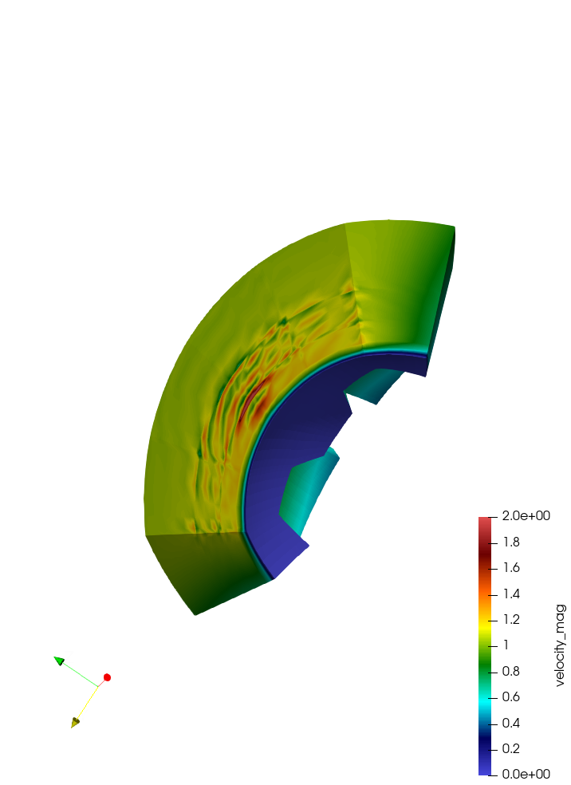

# CFL detection and Element Filter
This example copies the CFL computation, detect high CFL, and dump the elements
around it.

We start with the `hemi` example from the repo, and set `subCyclingSteps=0` so
the CFL ~ 2 will diverge. 

NekRS Version: v24-pre (repo/next as of Sept. 2024)

### Demo

Two main control:
```
    dfloat cflThreshold1 = 2.0; // used to detect high CFL
    dfloat cflThreshold2 = 1.8; // used to dump element > this CFL
```

There are two main components:
- `cfl_compute`. This is copied from `src/nrs/cfl.cpp` so we have access of
    element-wise CFL number. 

- `iofld`: This is copied from the `turbPipe` example, we save velocity into a new checkpoint
    file and use elementFilter to only dump the elements having large CFL.


Expected behavior

- files
  ```
  $ head -c 132 cfl0.f0*

  ==> cfl0.f00000 <==
  #std 4  8  8  8         20         20  0.1610000000000E+00         0      0      1 XU          0.0000000E+00 F                      
  ==> cfl0.f00001 <==
  #std 4  8  8  8         32         32  0.1680000000000E+00         0      0      1 XU          0.0000000E+00 F                      
  ==> cfl0.f00002 <==
  #std 4  8  8  8         42         42  0.1750000000000E+00         0      0      1 XU          0.0000000E+00 F                      
  ==> cfl0.f00003 <==
  #std 4  8  8  8         48         48  0.1820000000000E+00         0      0      1 XU          0.0000000E+00 F 
  ```

- logfile
  ```
  $ grep "^step= \|writing" logfile 

  step= 1  t= 7.00000000e-03  dt=7.0e-03  C= 1.567  elapsedStep= 9.11e-01s  elapsedStepSum= 9.10699e-01s
  step= 2  t= 1.40000000e-02  dt=7.0e-03  C= 1.591  elapsedStep= 6.36e-01s  elapsedStepSum= 1.54641e+00s
  step= 3  t= 2.10000000e-02  dt=7.0e-03  C= 1.589  elapsedStep= 5.93e-01s  elapsedStepSum= 2.13978e+00s
  step= 4  t= 2.80000000e-02  dt=7.0e-03  C= 1.589  elapsedStep= 4.99e-01s  elapsedStepSum= 2.63898e+00s
  step= 5  t= 3.50000000e-02  dt=7.0e-03  C= 1.585  elapsedStep= 4.53e-01s  elapsedStepSum= 3.09161e+00s
  step= 6  t= 4.20000000e-02  dt=7.0e-03  C= 1.577  elapsedStep= 3.35e-01s  elapsedStepSum= 3.42701e+00s
  step= 7  t= 4.90000000e-02  dt=7.0e-03  C= 1.567  elapsedStep= 3.44e-01s  elapsedStepSum= 3.77138e+00s
  step= 8  t= 5.60000000e-02  dt=7.0e-03  C= 1.554  elapsedStep= 3.10e-01s  elapsedStepSum= 4.08168e+00s
  step= 9  t= 6.30000000e-02  dt=7.0e-03  C= 1.539  elapsedStep= 3.08e-01s  elapsedStepSum= 4.38994e+00s
  step= 10  t= 7.00000000e-02  dt=7.0e-03  C= 1.529  elapsedStep= 3.10e-01s  elapsedStepSum= 4.70002e+00s
  step= 11  t= 7.70000000e-02  dt=7.0e-03  C= 1.534  elapsedStep= 3.26e-01s  elapsedStepSum= 5.02620e+00s
  step= 12  t= 8.40000000e-02  dt=7.0e-03  C= 1.539  elapsedStep= 3.24e-01s  elapsedStepSum= 5.35011e+00s
  step= 13  t= 9.10000000e-02  dt=7.0e-03  C= 1.543  elapsedStep= 3.31e-01s  elapsedStepSum= 5.68065e+00s
  step= 14  t= 9.80000000e-02  dt=7.0e-03  C= 1.546  elapsedStep= 3.09e-01s  elapsedStepSum= 5.98948e+00s
  step= 15  t= 1.05000000e-01  dt=7.0e-03  C= 1.549  elapsedStep= 3.12e-01s  elapsedStepSum= 6.30103e+00s
  step= 16  t= 1.12000000e-01  dt=7.0e-03  C= 1.552  elapsedStep= 3.15e-01s  elapsedStepSum= 6.61561e+00s
  step= 17  t= 1.19000000e-01  dt=7.0e-03  C= 1.553  elapsedStep= 3.28e-01s  elapsedStepSum= 6.94328e+00s
  step= 18  t= 1.26000000e-01  dt=7.0e-03  C= 1.555  elapsedStep= 3.29e-01s  elapsedStepSum= 7.27187e+00s
  step= 19  t= 1.33000000e-01  dt=7.0e-03  C= 1.556  elapsedStep= 3.38e-01s  elapsedStepSum= 7.60946e+00s
  step= 20  t= 1.40000000e-01  dt=7.0e-03  C= 1.556  elapsedStep= 3.84e-01s  elapsedStepSum= 7.99390e+00s
  step= 21  t= 1.47000000e-01  dt=7.0e-03  C= 1.605  elapsedStep= 3.80e-01s  elapsedStepSum= 8.37395e+00s
  step= 22  t= 1.54000000e-01  dt=7.0e-03  C= 1.634  elapsedStep= 3.81e-01s  elapsedStepSum= 8.75455e+00s
  writing checkpoint ...
  step= 23  t= 1.61000000e-01  dt=7.0e-03  C= 2.851  elapsedStep= 4.32e-01s  elapsedStepSum= 9.18647e+00s
  writing checkpoint ...
  step= 24  t= 1.68000000e-01  dt=7.0e-03  C= 8.403  elapsedStep= 4.79e-01s  elapsedStepSum= 9.66541e+00s
  writing checkpoint ...
  step= 25  t= 1.75000000e-01  dt=7.0e-03  C= 8.390  elapsedStep= 4.41e-01s  elapsedStepSum= 1.01065e+01s
  writing checkpoint ...
  ```

- Visualization
  Note that ParaView seems to struggle when the number of elements changes.
  We save mesh to each checkpoint file and one might want to rename the file.
  For example, `mv cfl0.f00003 t30.f00001` then `visnek t3` yields a `t3.nek5000`
  to open. 

  
