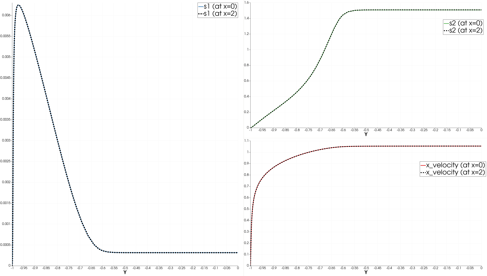

# RANS k-tau Channel with Recycling

- Version: nekrs v23 cardinal (v23-next + something)

  Last clone: 07/01/25

  ```
  https://github.com/neams-th-coe/nekRS
  48e408eb9a1f4de674efd243a982c84300c792e4
  ```

### Setup guide

Here we simply extend the interface of `velRecycling` plugin let user copy scalars.

- Copy `velRecycling.cpp` and `velRecycling.hpp` to `nekrs/src/plugins/`.
- Copy `setBCScalarValue.okl` and `scalarRecyclingMaskCopy.okl` to `kernels/plugins/`


- Copy the `ktauChannel` example, modify the BC to inflow/outflow

  See `input_vO.box` for the modified box file; (usr) usrda2 for `boundaryID`; `par` for updated BC maps.

  Remove `ciMode`, but copy `ciTestError` to check `u_tau`.

- (`UDF_Setup`) Add velocity recycling from the `turbPipe` example.

   Pretty much the same setup except now we expend the `nrs->o_usrwrk` to accommodate scalars.

  ```
  { // velocity recycling
    auto xLen = abs( 
                platform->linAlg->max(mesh->Nlocal, mesh->o_x, platform->comm.mpiComm) -
                platform->linAlg->min(mesh->Nlocal, mesh->o_x, platform->comm.mpiComm)
              );

    int nfld = nrs->NVfields + nrs->Nscalar;
    nrs->o_usrwrk = platform->device.malloc<dfloat>(nfld * nrs->fieldOffset);
  
    const dfloat uBulk = 1.0; // flow rate
    const int bID = 1; // inlet bc id
    dfloat xRecycLayer = 0.25 * xLen; // recycling shift
    velRecycling::setup(nrs, nrs->o_usrwrk, xRecycLayer, 0.0, 0.0, bID, uBulk);
  }
  ```

- (`UDF_ExecuteStep`) Add the usual `velRecycling::copy();` for velocity.

  Manually copy scalars into the corresponding work array.
  ```
  velRecycling::copy_scalar(nrs, o_wrk_k, o_k);
  ```

- See `.oudf` for boundary condition. Each field access its slot for `usrwrk`


### Verification

Notes:

- We use smaller dt (1/5x) to pass the un-physical initial condition.   
  
- `u_tau` matches with the reference.
  ```
  4600 time: 4.600000e+01   tau: 0.0449698; relative error = 0.0198257
  4700 time: 4.700000e+01   tau: 0.0449461; relative error = 0.0203431
  4800 time: 4.800000e+01   tau: 0.0449043; relative error = 0.0212526
  4900 time: 4.900000e+01   tau: 0.0448538; relative error = 0.0223534
  5000 time: 5.000000e+01   tau: 0.0448469; relative error = 0.0225055
  ```

- Recycled values at the inlet matches the one at the recycled location (`x=2`).

  

