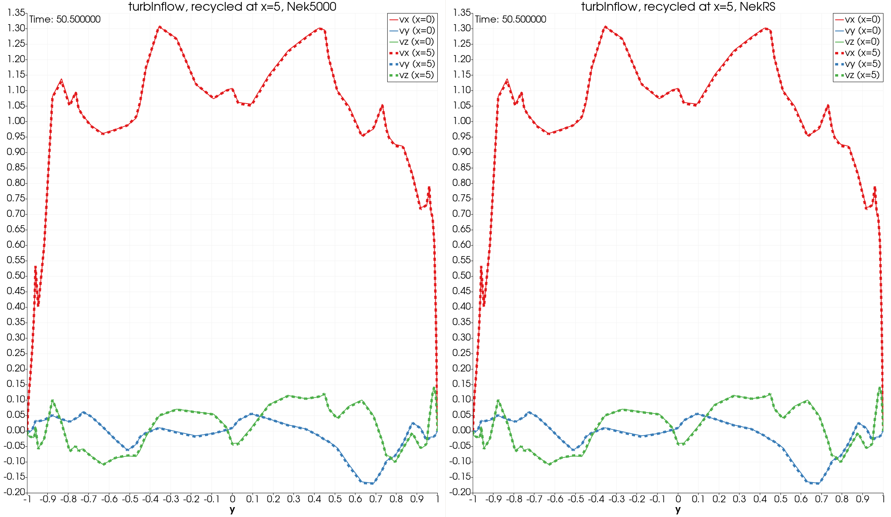

## Recycled Inflow

turbInflow example, copied from an old NekExamples.      

Half channel flow with v/O/W/W/W/SYM       
The inlet velocity is recycled at the shifted location with vector (5,0,0) via findpt.     
It's also rescaled to the target ubar.

The nekrs recycle function is initialted by Ansh.
See `UDF_Setup` for control.

08/05/24: Now we support multiple inlet rescaling.
User can add tuple of `{bID, dx, dy, dz, ubar}` for each set.
```
velInflowList.push_back(std::tuple{bID1, dx1, dy1, dz1, ubar1});
velInflowList.push_back(std::tuple{bID2, dx2, dy2, dz2, ubar2});
```


### Verson

- NekRS version: v23
- Nek5000 version, recent repo.


### Verification

Load restart file `r1.fld`, run visc = 1e-4 with Dong's outflow. 

- Plots     

  velocity components along the line at (0,y,0.5)     
  velocity components along the line at (5,y,0.5)     

  

- Perturbation energy      

  ubar = volume averaged vx      
  e2 = volume averaged of vy^2+vz^2    
  um = max. abs. vx     


  NekRS:
  ```
  istep  time         e2           ub           um
    91   5.04550e+01   7.79236e-03   1.00001e+00   1.49612e+00 e2(rs)
    92   5.04600e+01   7.79283e-03   1.00001e+00   1.49685e+00 e2(rs)
    93   5.04650e+01   7.79330e-03   1.00001e+00   1.49692e+00 e2(rs)
    94   5.04700e+01   7.79377e-03   1.00001e+00   1.49636e+00 e2(rs)
    95   5.04750e+01   7.79424e-03   1.00001e+00   1.49523e+00 e2(rs)
    96   5.04800e+01   7.79471e-03   1.00001e+00   1.49833e+00 e2(rs)
    97   5.04850e+01   7.79518e-03   1.00001e+00   1.50126e+00 e2(rs)
    98   5.04900e+01   7.79565e-03   1.00001e+00   1.50325e+00 e2(rs)
    99   5.04950e+01   7.79612e-03   1.00001e+00   1.50468e+00 e2(rs)
   100   5.05000e+01   7.79659e-03   1.00001e+00   1.50566e+00 e2(rs)
  ```

  Nek5000
  ```
  istep time         e2           ub           um
    91  5.04550E+01  7.79192E-03  1.00001E+00  1.49612E+00 e2
    92  5.04600E+01  7.79240E-03  1.00001E+00  1.49685E+00 e2
    93  5.04650E+01  7.79287E-03  1.00001E+00  1.49692E+00 e2
    94  5.04700E+01  7.79335E-03  1.00001E+00  1.49636E+00 e2
    95  5.04750E+01  7.79382E-03  1.00001E+00  1.49523E+00 e2
    96  5.04800E+01  7.79430E-03  1.00001E+00  1.49833E+00 e2
    97  5.04850E+01  7.79477E-03  1.00001E+00  1.50126E+00 e2
    98  5.04900E+01  7.79524E-03  1.00001E+00  1.50325E+00 e2
    99  5.04950E+01  7.79571E-03  1.00001E+00  1.50468E+00 e2
   100  5.05000E+01  7.79618E-03  1.00001E+00  1.50566E+00 e2
  ```


